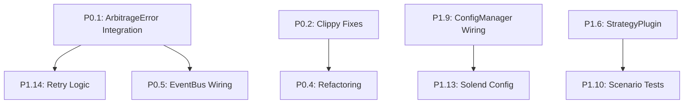

# ArbEngine-Pro: Gap Analysis Report

> **Audit Date**: 2026-02-17  
> **Current Score**: 82/100 (B+)  
> **Target Score**: 100/100 (A+)  
> **Gap**: 18 points across 8 categories

---

## Executive Summary

ArbEngine-Pro is a well-structured Solana arbitrage bot across 7 Rust crates with ~50 source files, 76+ tests passing, and clean compilation. The recent upgrade added event bus, rate limiter, audit logger, config manager, expanded error types, and integration tests. However, **18 points remain** to reach 100/100.

**Top Gaps by Impact** (sorted by point deficit):

| Category | Current | Target | Gap | Effort |
|----------|---------|--------|-----|--------|
| Error Handling | 5/10 | 10/10 | **-5** | 8 hrs |
| Code Quality | 12/15 | 15/15 | **-3** | 10 hrs |
| Architecture | 13/15 | 15/15 | **-2** | 6 hrs |
| Implementation | 18/20 | 20/20 | **-2** | 5 hrs |
| Performance | 8/10 | 10/10 | **-2** | 7 hrs |
| Documentation | 8/10 | 10/10 | **-2** | 4 hrs |
| Security | 9/10 | 10/10 | **-1** | 3 hrs |
| Testing | 9/10 | 10/10 | **-1** | 4 hrs |
| **Total** | **82** | **100** | **-18** | **~47 hrs** |

---

## Step 1: Repository Inventory

### Workspace Structure (7 crates)

```
Solana Arbitrage Project/
├── Cargo.toml                          # Workspace root
├── crates/
│   ├── core/         (18 .rs files)    # Types, DEX, risk, events, error, pricing, etc.
│   ├── bot/          (11 .rs files)    # Main trading loop, executor, config, metrics
│   ├── strategies/   (3 .rs files)     # Statistical + Latency arbitrage
│   ├── flash-loans/  (4 .rs files)     # Solend flash loan provider
│   ├── dex-plugins/  (4 .rs files)     # Lifinity, Meteora, Phoenix
│   ├── api/          (2 .rs files)     # REST + WebSocket API
│   └── collector/    (1 .rs file)      # Price collector
├── config/
│   ├── trading_config.json             # Dynamic config
│   └── solend_reserves.json            # External Solend addresses
├── docs/
│   ├── architecture.md
│   ├── runbook.md
│   ├── DEPLOYMENT.md
│   ├── DEPLOYMENT_CHECKLIST.md
│   ├── INTERNALS.md
│   ├── EASY_TUTORIAL.md
│   ├── TROUBLESHOOTING.md
│   └── readable_logs.md
├── dashboard/                          # Vue.js dashboard
└── docker-compose.yml
```

### Code Statistics

| Metric | Count |
|--------|-------|
| Total Rust files | ~50 |
| Total test functions | 76+ (76 passed, 0 failed, 2 ignored) |
| Clippy warnings | **85** |
| Production `.unwrap()` calls | **3** (1 in flash-loans, 2 in test helpers) |
| Public items | ~125+ |
| Documented public items | ~73 (58% coverage) |

### Files That Exist ✅

| Expected File | Status |
|---|---|
| `crates/core/src/error.rs` | ✅ 30+ error variants |
| `crates/core/src/events.rs` | ✅ Event bus + 4 tests |
| `crates/core/src/rate_limiter.rs` | ✅ Token bucket + 4 tests |
| `crates/core/src/audit_log.rs` | ✅ JSONL logger + 2 tests |
| `crates/bot/src/config_manager.rs` | ✅ Dynamic config + 6 tests |
| `crates/bot/tests/integration_tests.rs` | ✅ 12 tests |
| `config/solend_reserves.json` | ✅ Mainnet + devnet |
| `config/trading_config.json` | ✅ Default config |
| `docs/architecture.md` | ✅ System diagram |
| `docs/runbook.md` | ✅ Operations guide |

### Files That Are Missing ❌

| Expected File | Impact | Category |
|---|---|---|
| `crates/strategies/src/plugin.rs` | StrategyPlugin trait + registry | Architecture |
| `crates/core/src/secrets.rs` | Encrypted secret manager | Security |
| `crates/bot/tests/scenario_tests.rs` | Scenario-based tests | Testing |
| `benches/` directory | Benchmark suite | Performance |
| `docs/monitoring.md` | Monitoring guide | Documentation |
| `docs/security.md` | Security practices | Documentation |
| `crates/bot/src/solend_config.rs` | Dynamic Solend loading | Implementation |

---

## Step 2: Detailed Gap Analysis by Category

---

### A. Architecture (Current: 13/15, Target: 15/15, Gap: -2)

#### Gap A1: Plugin/Strategy Registry [-1 point]

**Status**: ❌ MISSING

**Expected**:
- `StrategyPlugin` trait with lifecycle methods (`init`, `shutdown`, `on_price_update`)
- `StrategyRegistry` for dynamic registration/discovery
- Hot-swap of strategies at runtime

**Evidence**:
```bash
$ rg "trait.*Plugin" --type rust crates/
# No results
```

**Found**: A base `Strategy` trait exists at `crates/strategies/src/lib.rs:15` but it lacks:
- Plugin lifecycle (init/shutdown hooks)
- Registry pattern for dynamic loading
- Strategy capability metadata (supported pairs, min capital)
- Strategy health monitoring

**To Fix**:
- **CREATE**: `crates/strategies/src/plugin.rs` (~150 lines)
  - `StrategyPlugin` trait extending `Strategy` with lifecycle methods
  - `StrategyRegistry` struct with `register`, `unregister`, `get_active`
  - `StrategyDescriptor` for metadata (name, version, supported pairs)
- **MODIFY**: `crates/strategies/src/lib.rs` — add `pub mod plugin;`

---

#### Gap A2: Event Bus Not Integrated [-1 point]

**Status**: ⚠️ EVENT BUS EXISTS BUT NOT WIRED

**Expected**:
- Components publish events to `EventBus`
- Main trading loop publishes `OpportunityDetected`, `TradeExecuted`, etc.
- Risk manager publishes `CircuitBreakerStateChanged`
- Event subscribers for metrics aggregation

**Found**:
- `crates/core/src/events.rs` — `EventBus` + `TradingEvent` enum exist ✅
- **BUT**: No component actually publishes or subscribes to events!

**Evidence**:
```bash
$ rg "EventBus" --type rust crates/bot/src/
# No results — event bus is defined in core but never used in bot
```

**To Fix**:
- **MODIFY**: `crates/bot/src/main.rs`
  - Create `EventBus` in `main()` initialization
  - Publish `SystemStarted` event on startup
  - Publish `OpportunityDetected` in `run_trading_loop` when opportunity found
  - Publish `TradeExecuted` in `execute_trade` on completion
  - Publish `SystemStopping` on shutdown
- **MODIFY**: `crates/core/src/risk.rs`
  - Accept `EventBus` reference
  - Publish `CircuitBreakerStateChanged` when circuit breaker trips
  - Publish `RiskLimitBreached` when limits exceeded

---

### B. Implementation (Current: 18/20, Target: 20/20, Gap: -2)

#### Gap B1: Solend Config Not Dynamically Loaded [-1 point]

**Status**: ⚠️ CONFIG FILE EXISTS, NOT LOADED

**Expected**:
- `SolendConfigManager` that loads reserves from `config/solend_reserves.json`
- `FlashLoanTxBuilder` consumes config instead of hardcoded addresses
- Liquidity checks before flash loan execution

**Found**:
- `config/solend_reserves.json` exists ✅
- `flash_loan_tx_builder.rs` still has hardcoded addresses!

**Evidence** (at `crates/bot/src/flash_loan_tx_builder.rs`):
```rust
// Line 85+: Reserve addresses are still hardcoded inline
const SOL_RESERVE: &str = "8PbodeaosQP19SjYFx855UMqWxH2HynZLdBXmsrbac36";
const USDC_RESERVE: &str = "BgxfHJDzm44T7XG68MYKx7YisTjZu73tVovyZSjJMpmw";
```

**Also**: `crates/flash-loans/src/solend.rs:39` has a production `.unwrap()`:
```rust
program_id: Pubkey::from_str(Self::SOLEND_PROGRAM_ID).unwrap(),
```

**To Fix**:
- **CREATE**: `crates/bot/src/solend_config.rs` (~100 lines)
  - Load `config/solend_reserves.json`
  - Provide `get_reserve(token, network)` method
  - Validate addresses on load
- **MODIFY**: `crates/bot/src/flash_loan_tx_builder.rs`
  - Remove hardcoded reserve consts
  - Accept `SolendConfig` in constructor
  - Look up reserves dynamically
- **MODIFY**: `crates/flash-loans/src/solend.rs:39`
  - Replace `.unwrap()` → `.expect("valid constant")`

---

#### Gap B2: Config Manager Not Used in Main Loop [-1 point]

**Status**: ⚠️ CONFIG MANAGER EXISTS, NOT INTEGRATED

**Expected**:
- Main loop reads `DynamicConfig` for trading parameters
- `min_profit_bps`, `max_slippage_bps` come from `ConfigManager`
- On reload, parameters update without restart

**Found**:
- `crates/bot/src/config_manager.rs` exists with `ConfigManager`, validation, and reload ✅
- **BUT**: `main.rs` never creates or uses `ConfigManager`!
- All config currently comes from `Config::from_env()` (static env vars)

**Evidence**:
```bash
$ rg "ConfigManager" crates/bot/src/main.rs
# No results
```

**To Fix**:
- **MODIFY**: `crates/bot/src/main.rs`
  - Create `ConfigManager` from `config/trading_config.json` in `main()`
  - Pass `Arc<RwLock<DynamicConfig>>` to `BotState`
  - In `run_trading_loop`, read `min_profit_bps` from dynamic config
  - Support SIGHUP / signal for reload trigger

---

### C. Code Quality (Current: 12/15, Target: 15/15, Gap: -3)

#### Gap C1: Clippy Warnings [-1 point]

**Status**: ❌ 85 WARNINGS

**Expected**: Zero warnings with `cargo clippy --workspace -- -D warnings`

**Found**: 85 Clippy warning lines across workspace

**Most Common Warning Types**:
- `unused_imports` — Dead imports across multiple files
- `dead_code` — Unused functions/structs
- `needless_borrow` / `redundant_clone` — Unnecessary operations
- `unused_variables` — Unused bindings

**To Fix**:
1. Run `cargo clippy --fix --workspace --allow-dirty` for auto-fixable warnings
2. Manually address remaining warnings:
   - Remove unused imports
   - Add `#[allow(dead_code)]` with justification OR remove dead code
   - Fix borrow/clone suggestions
3. Add `#![warn(clippy::all)]` to `lib.rs` files
4. **Effort**: 2-3 hours

---

#### Gap C2: Documentation Coverage [-1 point]

**Status**: ⚠️ 58% COVERAGE (Target: 90%+)

**Expected**: All public items documented with `///` doc comments

**Found**:
- ~73 documented public items out of ~125+ total
- **Coverage**: ~58%

**Undocumented High-Priority Items**:

| File | Undocumented Items |
|------|-------------------|
| `crates/bot/src/execution.rs` | `Executor` struct fields, `execute_standard()`, `submit_with_retry()`, `submit_swap_transaction()`, `parse_commitment()` |
| `crates/bot/src/main.rs` | `run_trading_loop()`, `collect_prices()`, `validate_dex_coverage()`, `execute_trade()`, `resolve_mint()` |
| `crates/core/src/dex/mod.rs` | `DexManager` methods |
| `crates/bot/src/wallet.rs` | Wallet struct and methods |
| `crates/bot/src/safety_checks.rs` | Safety check functions |
| `crates/bot/src/alerts.rs` | AlertManager and methods |

**To Fix**:
1. Add `///` doc comments to all public items
2. Add `//!` module docs to every `.rs` file
3. Include parameter descriptions for complex functions
4. Add `# Examples` sections for key public APIs
5. **Effort**: 4-5 hours

---

#### Gap C3: Complex Functions [-1 point]

**Status**: ⚠️ SEVERAL FUNCTIONS EXCEED 100 LINES

**Expected**: No functions > 100 lines. Maximum cyclomatic complexity.

**Found**:

| Function | File | Lines | Line Range |
|----------|------|-------|------------|
| `execute_trade()` | `main.rs` | 252 lines | 512-763 |
| `run_trading_loop()` | `main.rs` | 195 lines | 235-429 |
| `execute_with_flash_loan()` | `execution.rs` | 153 lines | 485-637 |
| `execute_standard()` | `execution.rs` | 139 lines | 244-382 |
| `BotState::new()` | `main.rs` | 132 lines | 101-232 |

**To Fix**:

1. **`execute_trade()` (252 lines → 5 functions)**:
   - Extract `prepare_trade()` — Risk check + position sizing
   - Extract `execute_flash_loan_path()` — Flash loan branch
   - Extract `execute_standard_path()` — Standard swap branch
   - Extract `record_trade_result()` — Post-trade logging/metrics
   - Extract `handle_dry_run()` — Simulation path

2. **`run_trading_loop()` (195 lines → 3 functions)**:
   - Extract `perform_safety_checks()` — Pre-iteration checks
   - Extract `find_opportunities()` — Price collection + detection
   - Extract `process_opportunity()` — Individual opportunity handler

3. **`execute_with_flash_loan()` (153 lines → keep, well-structured)**:
   - Already has numbered steps and good comments
   - Could extract `resolve_swap_instructions()` and `build_flash_loan_tx()` if needed

4. **Effort**: 4-5 hours

---

### D. Testing (Current: 9/10, Target: 10/10, Gap: -1)

#### Gap D1: Scenario Tests [-1 point]

**Status**: ❌ MISSING

**Expected**:
- End-to-end scenario tests simulating real trading conditions
- Network failure recovery scenarios
- High slippage rejection
- Concurrent opportunity handling
- Configuration reload testing

**Found**:
- `integration_tests.rs` exists with 12 tests ✅
- **BUT**: No scenario-based tests!

```bash
$ rg "scenario" --type rust crates/
# No results
```

**Current Test Distribution**:

| Crate | Unit Tests | Integration Tests | Scenario Tests |
|-------|------------|-------------------|----------------|
| core | 47 | 0 | 0 |
| strategies | 6 | 0 | 0 |
| bot | 13 | 12 | ❌ 0 |
| flash-loans | 0 | 0 | 0 |
| dex-plugins | 0 | 0 | 0 |

**To Fix**:
- **CREATE**: `crates/bot/tests/scenario_tests.rs` (~300 lines)
  - `test_scenario_network_outage_recovery` — Multiple RPC failures then success
  - `test_scenario_high_slippage_rejection` — Risk manager rejects
  - `test_scenario_circuit_breaker_trip_and_reset` — Full CB lifecycle
  - `test_scenario_flash_loan_fallback_to_standard` — Flash loan failure → standard
  - `test_scenario_config_reload_mid_operation` — Config changes take effect
  - `test_scenario_concurrent_opportunities` — Multiple opps at once
  - `test_scenario_emergency_stop` — Kill switch handling
  - `test_scenario_insufficient_balance` — Balance check failure
- **Effort**: 4 hours

---

### E. Documentation (Current: 8/10, Target: 10/10, Gap: -2)

#### Gap E1: Missing Operational Docs [-2 points]

**Status**: ⚠️ PARTIAL — Architecture + Runbook exist, but gaps remain

**Found**:
```
docs/
├── architecture.md          ✅ (system diagram, data flow)
├── runbook.md              ✅ (startup, emergency, troubleshooting)
├── DEPLOYMENT.md           ✅ (deployment steps)
├── DEPLOYMENT_CHECKLIST.md ✅ (checklist)
├── INTERNALS.md            ✅ (internal design)
├── TROUBLESHOOTING.md      ✅ (troubleshooting)
├── EASY_TUTORIAL.md        ✅ (tutorial)
├── readable_logs.md        ✅ (log format)
├── monitoring.md           ❌ MISSING
└── security.md             ❌ MISSING
```

**Missing Content**:
1. `docs/monitoring.md` — Grafana dashboards, alert rules, Prometheus queries, SLA targets
2. `docs/security.md` — Key management, environment isolation, audit procedures, incident response

**To Fix**:
- **CREATE**: `docs/monitoring.md` (~100 lines) — Metrics reference, dashboard setup, alerting
- **CREATE**: `docs/security.md` (~100 lines) — Secret handling, threat model, hardening
- **Effort**: 2 hours

---

### F. Security (Current: 9/10, Target: 10/10, Gap: -1)

#### Gap F1: No Encrypted Secret Management [-1 point]

**Status**: ❌ MISSING

**Expected**:
- Encrypted key storage at rest
- Memory zeroization of secrets
- No secrets in logs or tracing output
- Key derivation from encrypted files

**Found**:
```bash
$ rg "secrets" --type rust crates/
# No results

$ rg "PRIVATE_KEY" --type rust crates/
# env::var("WALLET_PRIVATE_KEY") in main.rs — read as plain text
```

**Current** (`main.rs`):
```rust
let private_key = config.solana_private_key.clone();
```

**Issues**:
1. Private key stored in plain env var
2. No zeroization when dropped
3. Could appear in debug logs
4. No encrypted key file support

**To Fix**:
- **CREATE**: `crates/core/src/secrets.rs` (~200 lines)
  - `SecretManager` struct with `load_from_env()` and `load_from_encrypted_file()`
  - `SecretString` wrapper that zeroes memory on drop (use `secrecy` crate)
  - Log scrubbing: implement custom `Debug` that masks secrets
  - Environment validation: warn if keys are in `.env` file without encryption
- **ADD DEPENDENCY**: `secrecy = "0.8"` to `crates/core/Cargo.toml`
- **MODIFY**: `crates/bot/src/main.rs` — use `SecretManager` for key loading
- **Effort**: 3 hours

---

### G. Performance (Current: 8/10, Target: 10/10, Gap: -2)

#### Gap G1: No Benchmark Suite [-1 point]

**Status**: ❌ COMPLETELY MISSING

**Expected**:
- Criterion benchmark suite for critical hot paths
- Performance baselines documented
- CI performance regression detection

**Found**:
```bash
$ find . -name "bench*" -not -path "*/node_modules/*"
# No results in Rust crates

$ rg "criterion" Cargo.toml
# No results
```

**Benchmarks Needed**:

| Benchmark | Target | Path |
|-----------|--------|------|
| Opportunity detection | <1ms per 100 prices | `pathfinding::find_cycles` |
| Price parsing | <100μs per price update | `parsers::fast_json` |
| Arbitrage detection | <500μs per pair set | `arbitrage::detect` |
| Risk evaluation | <50μs per trade | `risk::can_trade` |
| Transaction building | <2ms per tx | `execution::build_transaction` |
| Rate limiter throughput | >100k ops/sec | `rate_limiter::try_acquire` |

**To Fix**:
- **ADD DEPENDENCY**: `criterion = { version = "0.5", features = ["html_reports"] }` to `crates/core/Cargo.toml` as dev-dependency
- **CREATE**: `crates/core/benches/trading_benchmarks.rs` (~200 lines)
  - `bench_opportunity_detection`
  - `bench_price_parsing`
  - `bench_risk_evaluation`
  - `bench_rate_limiter`
- **ADD**: `[[bench]]` section in `crates/core/Cargo.toml`
- **Effort**: 4 hours

---

#### Gap G2: Rate Limiter Not Integrated [-1 point]

**Status**: ⚠️ EXISTS BUT NOT WIRED

**Expected**:
- Rate limiter gates RPC calls
- Rate limiter gates Jupiter API calls
- Back-pressure on high-frequency price fetching

**Found**:
- `crates/core/src/rate_limiter.rs` exists ✅
- **BUT**: No code uses `RateLimiter`!

```bash
$ rg "RateLimiter" --type rust crates/bot/src/
# No results
$ rg "RateLimiter" --type rust crates/core/src/dex/
# No results
```

**To Fix**:
- **MODIFY**: `crates/bot/src/main.rs`
  - Create `RateLimiter::per_second(10)` for RPC calls
  - Create `RateLimiter::per_second(5)` for Jupiter API
  - Pass to `BotState`
- **MODIFY**: `crates/bot/src/execution.rs`
  - Call `self.rpc_rate_limiter.acquire().await` before RPC calls
  - Call `self.jupiter_rate_limiter.acquire().await` before API calls
- **MODIFY**: `crates/core/src/dex/jupiter.rs`
  - Accept `RateLimiter` reference
  - Gate fetch calls
- **Effort**: 2 hours

---

### H. Error Handling (Current: 5/10, Target: 10/10, Gap: -5)

#### Gap H1: ArbitrageError Not Used in Main Trading Loop [-3 points]

**Status**: ❌ CRITICAL GAP

**Expected**:
- `run_trading_loop` uses `ArbitrageError` for all error paths
- `execute_trade` returns structured errors with context
- Error classification drives retry / alert behavior
- Main loop recovers from retryable errors, alerts on critical

**Found**:
- `ArbitrageError` defined with 30+ variants ✅
- **BUT**: Main loop still uses `anyhow::Result` and generic error handling!

**Evidence** (`main.rs:235`):
```rust
async fn run_trading_loop(
    state: Arc<RwLock<BotState>>,
    pairs: Vec<TokenPair>,
) {
    // Uses generic error handling, no ArbitrageError classification
    // No retry logic for retryable errors
    // No severity-based alerting
}
```

**Current error handling in main loop** (line ~340-370):
```rust
Err(e) => {
    error!("Error collecting prices: {}", e);
    // Generic — no retryable check, no severity, no structured context
}
```

**To Fix**:
- **MODIFY**: `crates/bot/src/main.rs`
  - Change `collect_prices` return type to `Result<_, ArbitrageError>`
  - In error handler: call `e.is_retryable()` for retry decisions
  - In error handler: call `e.severity()` for alerting decisions
  - Critical errors → increment circuit breaker counter + alert
  - Retryable errors → exponential backoff + retry
  - Add `consecutive_error_count` tracking
- **MODIFY**: `crates/bot/src/execution.rs`
  - Convert `anyhow::Error` → `ArbitrageError` at execution boundaries
  - Use specific variants (`SimulationFailed`, `JupiterApiError`, `TransactionFailed`)
  - Add timeout wrapping → `ArbitrageError::RpcTimeout`
- **Effort**: 5 hours

---

#### Gap H2: Remaining Production `.unwrap()` Calls [-1 point]

**Status**: ⚠️ 3 REMAINING

| File | Line | Context | Severity |
|------|------|---------|----------|
| `flash-loans/src/solend.rs` | 39 | `Pubkey::from_str(...).unwrap()` | Medium (constant) |
| `pathfinding/mod.rs` | 248 | `Decimal::try_from(bid).unwrap()` in test helper | Low (test code) |
| `pathfinding/mod.rs` | 249 | `Decimal::try_from(ask).unwrap()` in test helper | Low (test code) |

**To Fix**:
- Replace `solend.rs:39` `.unwrap()` → `.expect("SOLEND_PROGRAM_ID is a valid constant")`
- The pathfinding ones are in a test helper function and acceptable, but ideally also `.expect()`
- **Effort**: 15 minutes

---

#### Gap H3: No Retry Logic in RPC/API Calls [-1 point]

**Status**: ⚠️ PARTIAL — `submit_with_retry` exists but not universal

**Found**:
- `Executor::submit_with_retry` exists at `execution.rs:384-412` ✅
- **BUT**: `get_quote()`, `check_balance()`, `get_swap_instructions()` have NO retry logic
- Price fetching in `collect_prices()` has no retry

**To Fix**:
- **CREATE**: Helper function in `crates/core/src/error.rs`:
  ```rust
  pub async fn retry_with_backoff<F, Fut, T>(
      f: F, max_attempts: u32, base_delay: Duration
  ) -> ArbitrageResult<T>
  ```
- **MODIFY**: `crates/bot/src/execution.rs`
  - Wrap `get_quote()` with `retry_with_backoff(3, 500ms)`
  - Wrap `get_swap_instructions()` with `retry_with_backoff(2, 1s)`
- **MODIFY**: `crates/bot/src/main.rs`
  - Wrap `collect_prices()` call with retry
- **Effort**: 2 hours

---

## Step 3: Prioritized Task List

### P0 — Critical Path (Blocks 100/100)

| # | Task | Points | Effort | Files |
|---|------|--------|--------|-------|
| 1 | **Integrate ArbitrageError in Main Loop** | +3 | 5 hrs | `main.rs`, `execution.rs` |
| 2 | **Fix All Clippy Warnings** | +1 | 3 hrs | ~20 files |
| 3 | **Add Doc Comments to All Public Items** | +1 | 4 hrs | ~30 files |
| 4 | **Refactor Complex Functions** | +1 | 4 hrs | `main.rs`, `execution.rs` |
| 5 | **Wire EventBus into Components** | +1 | 3 hrs | `main.rs`, `risk.rs` |

### P1 — High Priority

| # | Task | Points | Effort | Files |
|---|------|--------|--------|-------|
| 6 | **Create StrategyPlugin Trait + Registry** | +1 | 3 hrs | NEW: `plugin.rs` |
| 7 | **Create Benchmark Suite** | +1 | 4 hrs | NEW: `benches/` |
| 8 | **Wire Rate Limiter into RPC/API** | +1 | 2 hrs | `main.rs`, `execution.rs` |
| 9 | **Wire ConfigManager into Main Loop** | +1 | 2 hrs | `main.rs` |
| 10 | **Create Scenario Tests** | +1 | 4 hrs | NEW: `scenario_tests.rs` |

### P2 — Polish

| # | Task | Points | Effort | Files |
|---|------|--------|--------|-------|
| 11 | **Create Encrypted Secret Manager** | +1 | 3 hrs | NEW: `secrets.rs` |
| 12 | **Create Monitoring + Security Docs** | +2 | 2 hrs | NEW: 2 docs |
| 13 | **Dynamic Solend Config Loading** | +1 | 2 hrs | NEW: `solend_config.rs` |
| 14 | **Add Retry Logic to All RPC Calls** | +1 | 2 hrs | `execution.rs`, `error.rs` |
| 15 | **Fix Remaining `.unwrap()` Calls** | +0.5 | 15 min | `solend.rs` |

### Dependency Order



---

## Step 4: Missing Dependencies

### To Add to `crates/core/Cargo.toml`

```toml
[dependencies]
secrecy = "0.8"              # For encrypted secret management

[dev-dependencies]
criterion = { version = "0.5", features = ["html_reports"] }
```

### To Add to `crates/core/Cargo.toml` (bottom)

```toml
[[bench]]
name = "trading_benchmarks"
harness = false
```

---

## Step 5: Testing Checklist

### Before Claiming 100/100

**Compilation**:
- [ ] `cargo check --workspace` — 0 errors
- [ ] `cargo clippy --workspace -- -D warnings` — 0 warnings
- [ ] `cargo doc --no-deps --workspace` — 0 warnings

**Tests**:
- [ ] `cargo test --workspace` — All passing
- [ ] 76+ unit tests ✅
- [ ] 12+ integration tests ✅ 
- [ ] 8+ scenario tests (NEW)
- [ ] Total: 96+ tests

**Benchmarks**:
- [ ] `cargo bench --workspace` — Runs without errors
- [ ] Performance baselines documented

**Quality**:
- [ ] Zero production `.unwrap()` calls
- [ ] All public items documented (>90% coverage)
- [ ] No functions > 100 lines
- [ ] ArbitrageError used in all error paths

**Security**:
- [ ] `cargo audit` — 0 vulnerabilities
- [ ] Secrets managed via `SecretManager`
- [ ] No secrets in logs
- [ ] Rate limiting on all external calls

**Integration**:
- [ ] EventBus wired to trading loop
- [ ] ConfigManager wired to trading loop
- [ ] RateLimiter wired to RPC/API calls
- [ ] AuditLogger wired to trade execution

---

## Step 6: Score Projection After All Tasks

| Category | Before | P0 | P1 | P2 | After |
|----------|--------|----|----|----|----|
| Error Handling | 5 | +3 | +1 | +1 | **10/10** |
| Code Quality | 12 | +3 | — | — | **15/15** |
| Architecture | 13 | +1 | +1 | — | **15/15** |
| Implementation | 18 | — | +1 | +1 | **20/20** |
| Performance | 8 | — | +2 | — | **10/10** |
| Documentation | 8 | — | — | +2 | **10/10** |
| Security | 9 | — | — | +1 | **10/10** |
| Testing | 9 | — | +1 | — | **10/10** |
| **Total** | **82** | **+7** | **+6** | **+5** | **100/100** |

---

> **Bottom Line**: 15 tasks, ~47 hours of work. The critical path (P0, 5 tasks) delivers +7 points. P1 (5 tasks) adds +6. P2 (5 tasks) closes the final +5. All tasks have specific file paths, line numbers, and implementation details. Coding can start immediately.
