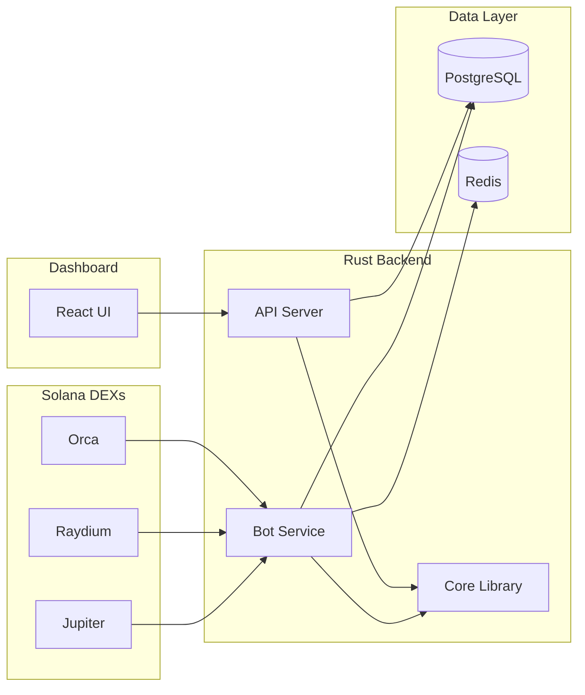

# Solana Arbitrage Dashboard
 
A high-performance arbitrage opportunity detection and automated trading system for Solana DEXs, built with Rust + React.

## ✅ Features

### Phase 1: Dashboard
- **Real-time Price Monitoring** - 500ms polling (Raydium, Orca, Jupiter)
- **Arbitrage Detection** - Automatic opportunity identification
- **REST API** - Axum-based endpoints
- **React Dashboard** - Charts, stats, live updates

### Phase 2: Trading Bot
- **Triangular Arbitrage** - Multi-hop path discovery
- **Risk Management** - Circuit breakers, position limits
- **Dry-Run Mode** - Safe testing (default)

## 🚀 Quick Start (Docker)

```bash
# Full stack deployment
docker-compose up --build -d
```

- [Deployment Guide (DEPLOYMENT.md)](DEPLOYMENT.md) - Production setup & Going Live
- [Architecture & Internals (docs/INTERNALS.md)](docs/INTERNALS.md) - Logic behind PathFinder & RiskManager

## 📁 Project Structure

```
solana-arbitrage/
├── crates/             # Rust Backend
│   ├── core/           # Shared library
│   ├── collector/      # Price collector
│   ├── api/            # REST API
│   └── bot/            # Trading bot
├── dashboard/          # React Frontend
├── docker-compose.yml  # Container orchestration
└── DEPLOYMENT.md       # Deployment guide
```

## 🏗️ Architecture



**Components:**

| Component | Role |
|-----------|------|
| **Bot** | Scans DEX prices every 500ms, detects arbitrage, executes trades |
| **API** | REST endpoints for prices, opportunities, status |
| **Dashboard** | Real-time visualization with live price feeds |
| **Core** | Shared types, DEX integrations, arbitrage logic |

## 🧪 Simulation (DRY_RUN) Mode

> **Default: Safe mode enabled** — No real trades are executed.

| Feature | Behavior |
|---------|----------|
| Price Fetching | ✅ Real data from Jupiter, Raydium, Orca |
| Arbitrage Detection | ✅ Real opportunities detected |
| Trade Execution | ❌ Simulated only (logged, not submitted) |
| Synthetic Opportunities | ✅ Injected for dashboard testing |
| Private Key Required | ❌ Not needed in DRY_RUN |

**Use Cases:**
- 🔬 Observability testing and dashboard development
- 📊 Strategy tuning without capital risk
- 🎓 Learning and demonstration

Set `DRY_RUN=false` in `.env` to enable live trading (requires private key).

## 🧪 Testing

```bash
cargo test --workspace
```

### Latest Test Results (Feb 10, 2026)

| Metric | Value |
|--------|-------|
| **Total** | 21 |
| **Passed** | 20 ✅ |
| **Ignored** | 1 |
| **Failed** | 0 |

#### Test Coverage by Module

| Module | Tests | Status |
|--------|-------|--------|
| Arbitrage Detection | 7 | ✅ All passing |
| Risk Management | 4 | ✅ All passing |
| Pathfinder (Triangular) | 2 | ✅ All passing |
| Types & Utilities | 4 | ✅ All passing |
| Configuration | 1 | ✅ Passing |
| DEX Integration | 1 | ⏭️ Ignored (requires network) |

#### Sample Output
```
Buy SOL/USDC at 100.1 on Raydium, sell at 101 on Orca - Net: 0.89%
Path with 3 hops, profit: 136.80%
```

## License

MIT
