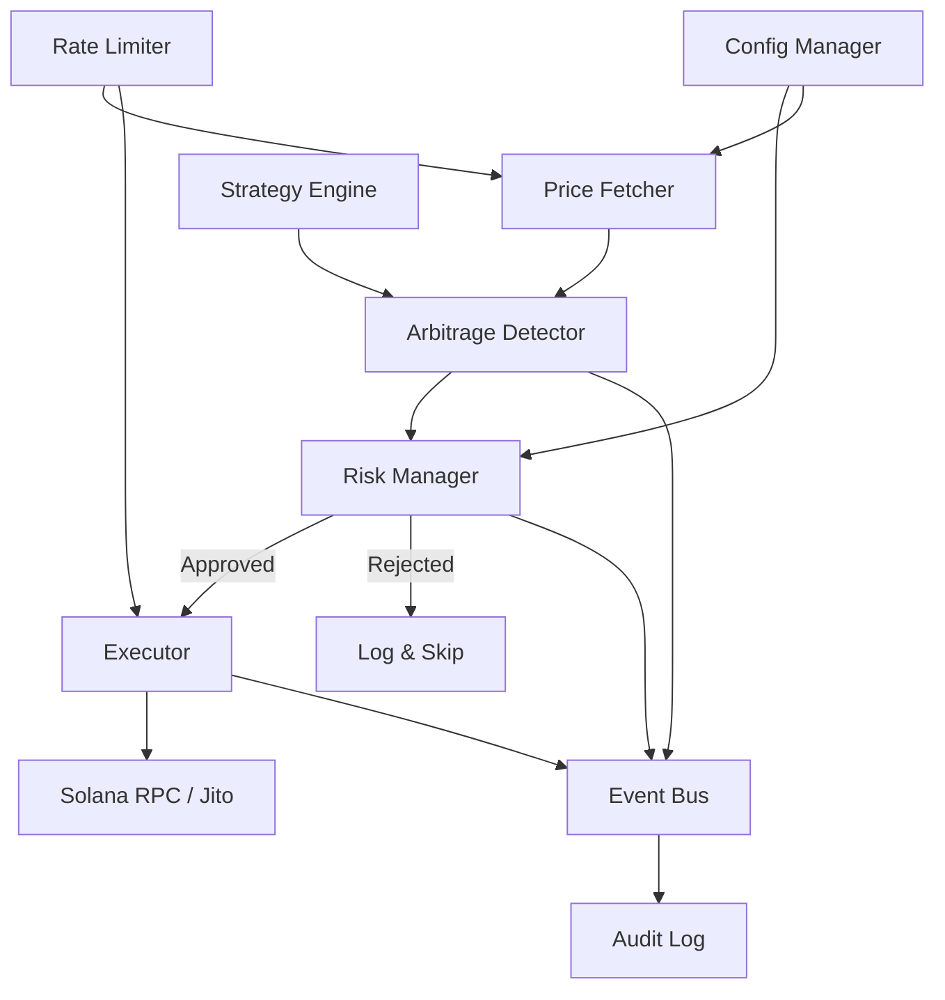

# ArbEngine-Pro Architecture

## System Overview

ArbEngine-Pro is an automated Solana arbitrage trading bot that detects cross-DEX price discrepancies and executes profitable trades with institutional-grade risk management.

## Crate Structure

| Crate | Purpose |
|-------|---------|
| `crates/core` | Shared types, DEX integrations, error handling, events, risk, pathfinding |
| `crates/bot` | Main trading loop, execution engine, health server, config management |
| `crates/strategies` | Statistical arbitrage, latency arbitrage strategy implementations |
| `crates/flash-loans` | Solend flash loan integration |
| `crates/dex-plugins` | Lifinity, Meteora, Phoenix DEX provider plugins |
| `crates/api` | REST + WebSocket API for monitoring |

## Core Components

### Error Handling (`crates/core/src/error.rs`)
- **`ArbitrageError`**: 30+ typed error variants covering RPC, execution, flash loans, risk, and strategy errors
- **Severity classification**: `Warning` (retryable), `Error` (operational), `Critical` (alerts)
- **Methods**: `is_retryable()`, `is_critical()`, `severity()`

### Event Bus (`crates/core/src/events.rs`)
- Broadcast-channel based pub/sub using `tokio::sync::broadcast`
- Zero-copy event distribution to all subscribers
- Event types: `PriceUpdate`, `OpportunityDetected`, `TradeExecuted`, `CircuitBreakerStateChanged`, etc.

### Rate Limiter (`crates/core/src/rate_limiter.rs`)
- Sliding-window token bucket algorithm
- Async-safe with `tokio::sync::Mutex`
- `acquire()` (blocking), `try_acquire()` (non-blocking), `per_second()` convenience

### Audit Logger (`crates/core/src/audit_log.rs`)
- Append-only JSONL format for tamper-evidence
- Typed methods: `log_trade()`, `log_risk_event()`, `log_system_event()`
- Async file I/O with flush-on-write

### Risk Manager (`crates/core/src/risk.rs`)
- Position sizing with Kelly criterion
- VaR (Value at Risk) calculation  
- Circuit breaker with configurable thresholds
- Daily P&L tracking

### DEX Manager (`crates/core/src/dex/`)
- Unified `DexProvider` trait across 6 DEXs
- Parallel price fetching via `ParallelPriceFetcher`
- Jupiter, Raydium, Orca, Lifinity, Meteora, Phoenix

## Data Flow

1. **Price Collection**: `ParallelPriceFetcher` queries all DEX providers concurrently
2. **Opportunity Detection**: `ArbitrageDetector` + `PathFinder` find cross-DEX spreads
3. **Strategy Analysis**: `StatisticalArbitrage` + `LatencyArbitrage` generate additional signals
4. **Risk Check**: `RiskManager.can_trade()` returns `Approved`, `Reduced`, or `Rejected`
5. **Execution**: `Executor` submits via Jupiter API, optionally through Jito MEV protection
6. **Recording**: Results logged to `HistoryRecorder`, `AuditLogger`, and `EventBus`

## Configuration

| File | Purpose |
|------|---------|
| `.env` | Environment variables (RPC URL, keys, thresholds) |
| `config/trading_config.json` | Dynamic trading parameters (hot-reloadable) |
| `config/solend_reserves.json` | Solend reserve addresses (mainnet + devnet) |

## Health & Monitoring

- **Health endpoint**: `GET /health` on port 8080
- **Status endpoint**: `GET /status` on port 8080 (trades, circuit breaker, balance)
- **Metrics**: Prometheus format on configurable port (`/metrics`)
- **Kill switch**: Create `.kill` file in project root for graceful shutdown
